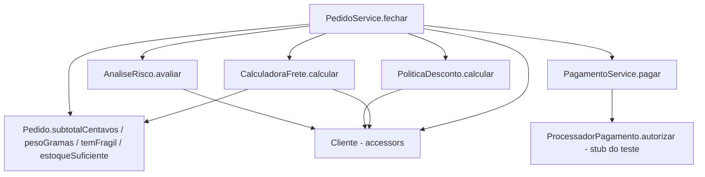
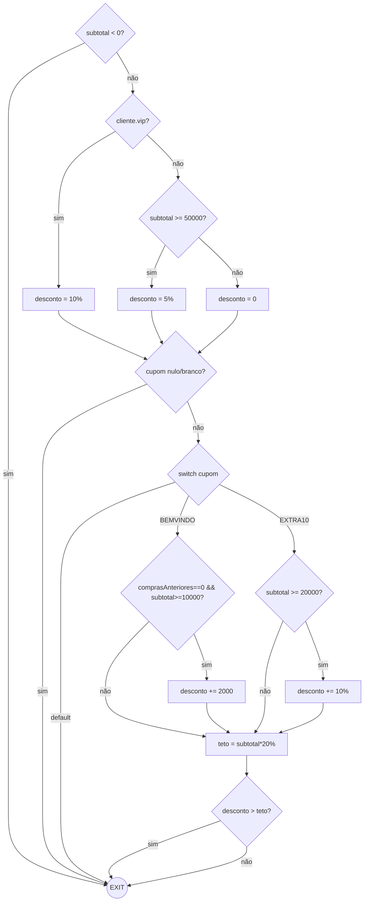
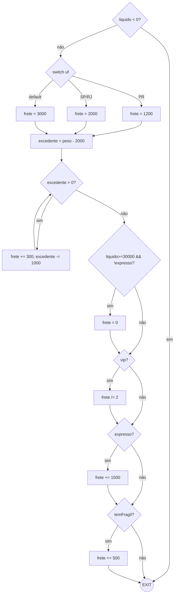
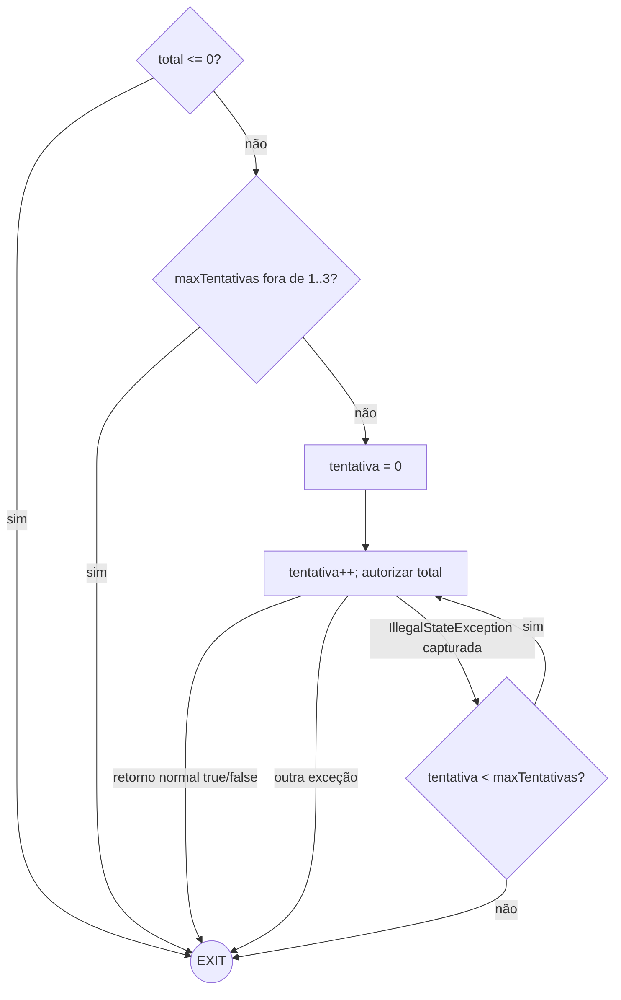
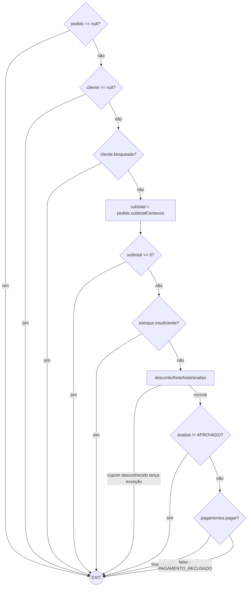

# Relatório do grupo

Integrantes: Heitor Freitas

## Modelo adotado para curto-circuito e exceções

Antes de desenhar os grafos, definimos duas regras pra não ficar inventando critério método por método:

- **Curto-circuito (`&&`/`||`):** contamos a expressão inteira como um nó só de decisão (ex.: `total > 100_000 || expresso` é um nó, não dois). Se abríssemos um nó por operando o grafo dobraria de tamanho sem mudar nada que a gente precise testar. O detalhe de o segundo operando às vezes nem rodar (curto-circuito) a gente não perde — isso fica registrado na Análise Crítica, com teste provando.
- **`throw` e exceção de método chamado:** viram mais uma seta saindo do bloco, indo direto pro EXIT, igual um `return`. Faz sentido porque o JaCoCo também não conta `try/catch` como branch (dá pra ver isso lá na Análise Crítica), mas a gente ainda testou esse desvio na prática.
- **Saída unificada:** todo `return`/`throw` de um método cai no mesmo nó EXIT. É o que a fórmula `V(G) = E − N + 2` pede pra funcionar certo.

## Grafo de chamadas



## Grafos e complexidade

| Método | Nós | Arestas | V(G) | Caminhos independentes | Restrições de viabilidade |
| --- | --- | --- | --- | --- | --- |
| `PoliticaDesconto.calcular` | 15 | 23 | 10 | 10 (ver matriz) | Não achei caminho inviável; dá pra alcançar toda combinação de cupom/perfil testando a classe sozinha. |
| `CalculadoraFrete.calcular` | 17 | 24 | 9 | 9 (ver matriz) | Gratuidade (D4) só liga com `!expresso`, então "gratuidade + expresso junto" não existe — expresso sempre desliga a gratuidade antes. |
| `AnaliseRisco.avaliar` | 6 | 10 | 6 | 6 (ver matriz) | Sem restrição, as 4 combinações de `comprasAnteriores==0` com a condição de cada lado são todas alcançáveis. |
| `PagamentoService.pagar` | 6 | 10 | 6 | 6 (ver matriz) | O caminho de exceção diferente de `IllegalStateException` não conta como branch pro JaCoCo (try/catch não vira decisão pra ele), mas é aresta de verdade no CFG e foi testado. |
| `PedidoService.fechar` | 10 | 17 | 9 | 9 (ver matriz) | O risco `RECUSADO` nunca aparece vindo de `fechar`, porque cliente bloqueado já sai com `BLOQUEADO` antes de chamar `AnaliseRisco.avaliar` — só dá pra ver `RECUSADO` testando `AnaliseRisco` sozinho (detalhe na Análise Crítica). |

### CFG — PoliticaDesconto.calcular



### CFG — CalculadoraFrete.calcular



### CFG — AnaliseRisco.avaliar

```mermaid
flowchart TD
    N1{total < 0?} -->|sim| EXIT((EXIT))
    N1 -->|não| N2{bloqueado?}
    N2 -->|sim| EXIT
    N2 -->|não| N3{comprasAnteriores==0?}
    N3 -->|sim| N4{total>100000 || expresso?}
    N3 -->|não| N5{total>500000 && !vip?}
    N4 -->|sim| EXIT
    N4 -->|não| EXIT
    N5 -->|sim| EXIT
    N5 -->|não| EXIT
```

### CFG — PagamentoService.pagar



### CFG — PedidoService.fechar



## Matriz de testes

Cada linha é um dos caminhos independentes que contamos lá em cima. Tem mais teste de fronteira no código do que linha aqui embaixo (valor um abaixo/igual/acima do limite, etc.) — não coloquei um por um pra tabela não ficar gigante, mas o padrão é o mesmo.

| ID / método JUnit | Unidade | Entrada e estado do stub | Resultado esperado | Caminho / aresta | Critério atendido |
| --- | --- | --- | --- | --- | --- |
| `deveRejeitarSubtotalNegativo` | PoliticaDesconto | subtotal=-1 | `IllegalArgumentException` | N1→EXIT (subtotal<0) | Decisão D1 |
| `clienteVipRecebeDezPorCento` | PoliticaDesconto | vip, subtotal=10000, cupom=null | 1000 | N1→N2(sim)→N3→N7(sim)→EXIT | D2 verdadeiro, D3 verdadeiro |
| `clienteComumComSubtotalNoLimiteRecebeCincoPorCento` | PoliticaDesconto | comum, subtotal=50000, cupom=null | 2500 | N2(não)→N4(sim)→N5→N7(sim)→EXIT | D2 falso, D4 verdadeiro |
| `clienteComumAbaixoDoLimiteNaoRecebeDesconto` | PoliticaDesconto | comum, subtotal=49999, cupom=null | 0 | N4(não)→N6→N7(sim)→EXIT | D4 falso |
| `cupomEmBrancoMantemDescontoBase` | PoliticaDesconto | vip, subtotal=10000, cupom="   " | 1000 | N7(sim, via isBlank) | D3 verdadeiro pelo 2º operando |
| `cupomBemVindoSomaVinteReaisParaClienteNovo` | PoliticaDesconto | comprasAnteriores=0, subtotal=10000, cupom=BEMVINDO | 2000 | N8→N9(sim)→N10→N13→N14→EXIT | D5 verdadeiro |
| `cupomBemVindoNaoSomaParaClienteComHistorico` | PoliticaDesconto | comprasAnteriores=1, subtotal=10000, cupom=BEMVINDO | 0 | N9(não)→N13→N14→EXIT | D5 falso |
| `cupomExtra10SomaDezPorCentoNoLimiteMinimo` | PoliticaDesconto | comum, subtotal=20000, cupom=EXTRA10 | 2000 | N8→N11(sim)→N12→N13→EXIT | D6 verdadeiro |
| `cupomExtra10NaoSomaAbaixoDoLimiteMinimo` | PoliticaDesconto | comum, subtotal=19999, cupom=EXTRA10 | 0 | N11(não)→N13→EXIT | D6 falso |
| `cupomDesconhecidoLancaExcecao` | PoliticaDesconto | cupom=INVALIDO | `IllegalArgumentException` | N8→EXIT (default) | D4(switch) ramo default |
| `descontoCombinadoRespeitaTetoDeVintePorCento` | PoliticaDesconto | vip, subtotal=10000, cupom=BEMVINDO | 2000 (capado) | N14(sim)→EXIT | D7 verdadeiro |
| `deveRejeitarValorLiquidoNegativo` | CalculadoraFrete | liquido=-1 | `IllegalArgumentException` | N1→EXIT | D1 |
| `baseParanaSemExcedenteDePeso` | CalculadoraFrete | uf=PR, peso=1000, liquido=1000 | 1200 | N2→N3→N6→N7(não)→N9(não)→N11(não)→N13(não)→N15(não)→EXIT | D2=PR, D3 falso |
| `baseSaoPaulo` / `baseRioDeJaneiro` | CalculadoraFrete | uf=SP / RJ | 2000 | N2→N4 | D2=SP/RJ |
| `baseDemaisEstados` | CalculadoraFrete | uf=MG | 3000 | N2→N5 | D2=default |
| `adicionalDePesoComUmGramaAcimaDoLimite` | CalculadoraFrete | peso=2001 | 1500 | N7(sim)→N8→N7(não) | D3 verdadeiro, 1 iteração |
| `freteGratisComLiquidoNoLimiteEEntregaNormal` | CalculadoraFrete | liquido=30000, expresso=false | 0 | N9(sim)→N10 | D4 verdadeiro |
| `clienteVipPagaMetadeDoFrete` | CalculadoraFrete | vip, liquido=1000 | 600 | N11(sim)→N12 | D5 verdadeiro |
| `entregaExpressaAcrescentaQuinzeReais` | CalculadoraFrete | expresso=true | 1200+1500 | N13(sim)→N14 | D6 verdadeiro |
| `itemFragilAcrescentaCincoReais` | CalculadoraFrete | fragil=true | 1200+500 | N15(sim)→N16 | D7 verdadeiro |
| `deveRejeitarTotalNegativo` | AnaliseRisco | total=-1 | `IllegalArgumentException` | N1→EXIT | D1 |
| `clienteBloqueadoERecusadoMesmoComTotalBaixo` | AnaliseRisco | bloqueado=true | RECUSADO | N2(sim)→EXIT | D2 verdadeiro |
| `clienteNovoComTotalETotalBaixoEEntregaNormalEAprovado` | AnaliseRisco | comprasAnteriores=0, total=100000, expresso=false | APROVADO | N4(não)→EXIT | D4 falso |
| `clienteNovoComTotalAcimaDoLimiteVaiParaRevisao` | AnaliseRisco | comprasAnteriores=0, total=100001 | REVISAO | N4(sim, 1º operando) | D4 verdadeiro |
| `clienteNovoComEntregaExpressaVaiParaRevisaoMesmoComTotalBaixo` | AnaliseRisco | comprasAnteriores=0, total=1000, expresso=true | REVISAO | N4(sim, 2º operando) | D4 verdadeiro via curto-circuito |
| `clienteComHistoricoETotalAltoNaoVipVaiParaRevisao` | AnaliseRisco | comprasAnteriores=3, total=500001, vip=false | REVISAO | N5(sim)→EXIT | D5 verdadeiro |
| `clienteComHistoricoENoLimiteExatoEAprovado` | AnaliseRisco | comprasAnteriores=3, total=500000 | APROVADO | N5(não, 1º operando) | D5 falso |
| `deveRejeitarTotalNaoPositivo` | PagamentoService | total=0 | `IllegalArgumentException` | N1→EXIT | D1 |
| `deveRejeitarLimiteDeTentativasForaDoIntervalo` | PagamentoService | maxTentativas=0 e 4 | `IllegalArgumentException` | N2→EXIT | D2 |
| `deveAprovarNaPrimeiraTentativa` | PagamentoService | stub retorna true | true, 1 chamada | N4→EXIT (retorno normal) | Aresta de sucesso |
| `deveRecusarImediatamenteSemRepetirQuandoProcessadorRetornaFalso` | PagamentoService | stub retorna false | false, 1 chamada | N4→EXIT (retorno normal) | Aresta de recusa imediata |
| `deveRepetirAposIndisponibilidadeEDepoisAprovar` | PagamentoService | stub lança IllegalStateException 2x, depois true | true, 3 chamadas | N4→N5→N4 (2x)→EXIT | D4 (laço) + exceção capturada |
| `deveRetornarFalsoAoEsgotarTentativasComIndisponibilidade` | PagamentoService | stub sempre lança IllegalStateException | false, 3 chamadas | N4→N5(não, esgotou)→EXIT | Esgotamento do laço |
| `devePropagarExcecoesDiferentesDeIndisponibilidade` | PagamentoService | stub lança RuntimeException | `RuntimeException` propagada | N4→EXIT (outra exceção) | Exceção não capturada (não contada como branch pelo JaCoCo) |
| `deveRejeitarPedidoNulo` | PedidoService | pedido=null | `NullPointerException` | N1→EXIT | D1 |
| `deveRejeitarClienteNulo` | PedidoService | cliente=null | `NullPointerException` | N2→EXIT | D2 |
| `clienteBloqueadoRetornaBloqueadoSemCobrancaEComValoresZerados` | PedidoService | bloqueado=true | status=BLOQUEADO, valores 0, 0 chamadas | N3(sim)→EXIT | D3 verdadeiro |
| `pedidoSemItensAtivosLancaExcecaoDeSubtotalZero` | PedidoService | item quantidade=0 | `IllegalArgumentException` | N5(sim)→EXIT | D4 |
| `faltaDeEstoqueRetornaSemEstoqueSemCobrancaEComValoresZerados` | PedidoService | quantidade > estoque | status=SEM_ESTOQUE, valores 0, 0 chamadas | N6(sim)→EXIT | D5 |
| `cupomDesconhecidoInterrompeFechamentoEProcessadorNaoEChamado` | PedidoService | cupom=CUPOM-INVALIDO | `IllegalArgumentException`, 0 chamadas | N7→EXIT (exceção) | Exceção propagada de colaborador |
| `riscoEmRevisaoRetornaValoresCalculadosSemCobranca` | PedidoService | subtotal alto, sem compras anteriores | status=REVISAO, valores calculados, 0 chamadas | N8(sim)→EXIT | D6 verdadeiro |
| `deveFecharPedidoDeClienteComumComFreteDoParanaEPagamentoAprovado` | PedidoService | exemplo fornecido, stub true | status=PAGO | N9(sim)→EXIT | D7 verdadeiro |
| `pagamentoRecusadoRetornaValoresCalculadosComUmaUnicaCobranca` | PedidoService | risco APROVADO, stub false | status=PAGAMENTO_RECUSADO, 1 chamada | N9(não)→EXIT | D7 falso |

## Evolução da cobertura

| Etapa | Testes executados | Linhas | Branches | Métodos | Classes | Lacunas e justificativas |
| --- | --- | --- | --- | --- | --- | --- |
| Inicial | 1 (exemplo dado) | Não medido | Não medido | Não medido | Não medido | Só `PedidoServiceTest` tinha um teste, o resto era esqueleto vazio. |
| Intermediária | 80 | 100% (108/108) | 95,7% (111/116) | 100% (21/21) | 100% (9/9) | Faltavam 5 branches em `Pedido` (validação de `itens`/`uf` e uma combinação do `&&` em `temFragil`) porque eu não tinha escrito nenhum teste só pra essa classe ainda — as linhas já batiam 100% porque outras classes passavam por esse código de leve, só não testavam todas as decisões. |
| Final | 94 | 100% (108/108) | 100% (116/116) | 100% (21/21) | 100% (9/9) | Fechei a lacuna com `PedidoTest`: `itens` nulo/>100 linhas, `uf` nula/formato errado, a combinação de curto-circuito do `temFragil` com item inativo e frágil junto, e falta de estoque no primeiro item da lista (além do último, que já estava coberto). |

(Números tirados de `target/site/jacoco/jacoco.csv` depois de rodar `mvn clean test`.)

## Análise crítica

- **Cobrir os dois lados de um `&&`/`||` não cobre as 4 combinações.** Em `AnaliseRisco.avaliar`, `total>100_000 || expresso` pode dar `true` de dois jeitos diferentes (pelo total ou pelo expresso), e são caminhos diferentes de verdade. Por isso separei `clienteNovoComTotalAcimaDoLimiteVaiParaRevisao` (dá true pelo total) de `clienteNovoComEntregaExpressaVaiParaRevisaoMesmoComTotalBaixo` (dá true só pelo expresso, com total baixo). Se testasse só um dos dois, o outro ficaria sem prova nenhuma.
- **Curto-circuito escondendo código que nunca roda.** Em `Pedido.temFragil` (`item.quantidade() > 0 && item.fragil()`), quando a quantidade é 0 o `fragil()` nem chega a ser chamado — Java para no primeiro `false`. O teste `temFragilIgnoraItemInativoMesmoQuandoFragil` mostra isso: cria um item com quantidade 0 e fragil `true`, e o resultado ainda é `false`. A mesma coisa acontece em `Pedido` (`itens == null || ...`) e em `PoliticaDesconto` (`cupom == null || cupom.isBlank()`).
- **Tem caminho que existe no papel mas não acontece de verdade.** `AnaliseRisco.avaliar` sozinho consegue retornar `"RECUSADO"` sem problema. Só que ninguém em `PedidoService.fechar` chega a ver isso: `fechar` já barra cliente bloqueado antes de chamar o `risco.avaliar(...)`, então esse `RECUSADO` é um caminho morto na integração — só existe se testar `AnaliseRisco` isolado (`AnaliseRiscoTest.clienteBloqueadoERecusadoMesmoComTotalBaixo`). O mesmo rola em `CalculadoraFrete`: gratuidade e adicional de expresso nunca aparecem juntos, porque a gratuidade só liga com `!expresso` — se é expresso, já era.
- **Exceção que o JaCoCo nem conta como branch, mas que testei mesmo assim.** O desvio do `try/catch` em `PagamentoService` não aparece na contagem de branches do relatório (o JaCoCo simplesmente não instrumenta isso como decisão). Mas o comportamento é real, então botei três testes pra cobrir as três saídas possíveis de `processador.autorizar(total)`: sucesso/recusa direto, indisponibilidade temporária com nova tentativa (`deveRepetirAposIndisponibilidadeEDepoisAprovar`), esgotamento (`deveRetornarFalsoAoEsgotarTentativasComIndisponibilidade`) e outra exceção que tem que propagar (`devePropagarExcecoesDiferentesDeIndisponibilidade`).
- **Quantas voltas de laço testei.** O `while` do peso em `CalculadoraFrete`: zero voltas (`semAdicionalDePesoNoLimiteExatoDeDoisQuilos`), uma volta completa (`adicionalDePesoComUmGramaAcimaDoLimite`), uma volta por causa de fração de kg (`adicionalDePesoCobraFracaoComoQuiloCompleto`) e três voltas (`adicionalDePesoComVariasIteracoes`). O `do/while` do pagamento: 1 tentativa, 3 tentativas com sucesso no meio, e 3 tentativas esgotadas sem sucesso nenhum.
- **Mutação proposital, pra provar que os testes pegam erro de verdade.** Mudei o desconto VIP em `PoliticaDesconto.calcular` de `subtotal * 10 / 100` pra `subtotal * 9 / 100` e rodei `mvn test -Dtest=PoliticaDescontoTest,PedidoServiceTest,CalculadoraFreteTest`. Quebrou na hora: `clienteVipRecebeDezPorCento` e `cupomEmBrancoMantemDescontoBase` falharam os dois, esperando 1000 e recebendo 900. Desfiz a mudança e rodei `mvn clean test` de novo — voltou pro 93/93 verde. Ou seja, a suíte realmente detecta essa regressão, não é só decoração.
