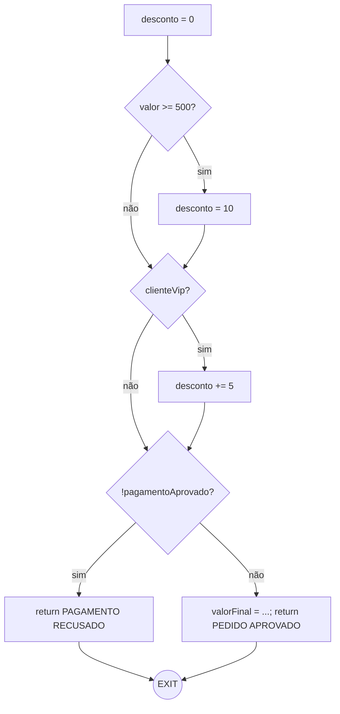
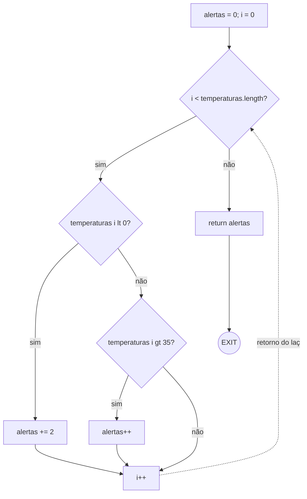

# Relatório — Exercícios de Grafo de Fluxo de Controle (Semana 07)

Integrantes: Heitor Henrique Scramim de Freitas
RA: 24190382-2

## Convenções adotadas

- Cada decisão (`if`, `else if`, `while`) vira um nó losango com duas saídas (verdadeiro/falso).
- Blocos sequenciais sem desvio foram agrupados num único nó retangular.
- Todo `return` liga direto ao nó `EXIT`.
- Laços têm aresta de retorno explícita da última instrução do corpo para a condição do `while`.

---

## Exercício 1 — `classificarPedido`

### Blocos básicos e decisões

| Nó | Conteúdo |
| --- | --- |
| N1 | `desconto = 0` (entrada) |
| N2 (D1) | `valor >= 500 ?` |
| N3 | `desconto = 10` |
| N4 (D2) | `clienteVip ?` |
| N5 | `desconto += 5` |
| N6 (D3) | `!pagamentoAprovado ?` |
| N7 | `return "PAGAMENTO RECUSADO"` |
| N8 | `valorFinal = ...; return "PEDIDO APROVADO: " + valorFinal` |
| N9 | EXIT |

3 decisões: D1, D2, D3.

### CFG

### Contagem e complexidade

- N = 9, E = 11
- `V(G) = E - N + 2 = 11 - 9 + 2 = 4`
- `V(G) = decisões + 1 = 3 + 1 = 4`

### Base de caminhos independentes (4)

| # | Caminho | `valor` | `clienteVip` | `pagamentoAprovado` | Resultado esperado |
| --- | --- | --- | --- | --- | --- |
| P1 | N1-N2(F)-N4(F)-N6(F)-N8-N9 | 100 | false | true | `PEDIDO APROVADO: 100.0` |
| P2 | N1-N2(T)-N3-N4(F)-N6(F)-N8-N9 | 600 | false | true | `PEDIDO APROVADO: 540.0` |
| P3 | N1-N2(F)-N4(T)-N5-N6(F)-N8-N9 | 100 | true | true | `PEDIDO APROVADO: 95.0` |
| P4 | N1-N2(F)-N4(F)-N6(T)-N7-N9 | 100 | false | false | `PAGAMENTO RECUSADO` |

As 4 arestas "novas" que cada caminho acrescenta cobrem as 11 arestas do grafo (P1 cobre o tronco principal; P2 acrescenta N2→N3→N4; P3 acrescenta N4→N5→N6; P4 acrescenta N6→N7→N9).

### Questões para discussão

- **Quantas combinações entre as três condições são possíveis?** 2³ = 8 — as três decisões são avaliadas sempre, em sequência, sem nenhuma pular a outra.
- **O número de combinações é igual à complexidade ciclomática? Explique.** Não. Combinações crescem multiplicativamente (2ⁿ = 8), enquanto `V(G)` cresce de forma aditiva (n + 1 = 4) pq decisões sequenciais e independentes convergem no mesmo nó antes da próxima decisão. a base de caminhos independentes cobre todas as arestas do grafo, não todas as combinações de entrada.
- **Como o `return` dentro da terceira condição altera o grafo?** Cria uma saída antecipada própria (N7→EXIT) sem passar por N8. Sem ele, haveria só uma aresta de saída no final e P4 não existiria como caminho distinto.
- **É possível executar o cálculo de `valorFinal` quando o pagamento não foi aprovado?** Não — `!pagamentoAprovado == true` sempre retorna em N7 antes de chegar em N8.

---

## Exercício 2 — `contarAlertas`

### Blocos básicos e decisões

| Nó | Conteúdo |
| --- | --- |
| N1 | `alertas = 0; i = 0` (entrada) |
| N2 (D1) | `i < temperaturas.length ?` (condição do while) |
| N3 (D2) | `temperaturas[i] < 0 ?` |
| N4 | `alertas += 2` |
| N5 (D3) | `temperaturas[i] > 35 ?` (else if) |
| N6 | `alertas++` |
| N7 | `i++` (junção dos 3 ramos + retorno do laço) |
| N8 | `return alertas` |
| N9 | EXIT |

3 decisões: D1 (while), D2 (if), D3 (else if).

### CFG

### Contagem e complexidade

- N = 9, E = 11
- `V(G) = E - N + 2 = 11 - 9 + 2 = 4`
- `V(G) = decisões + 1 = 3 + 1 = 4`

### Base de caminhos independentes (4)

| # | Caminho | Entrada | Retorno esperado |
| --- | --- | --- | --- |
| P1 | N1-N2(F)-N8-N9 | `[]` (vazio) | `0` — sai do laço sem iterar |
| P2 | N1-N2(T)-N3(T)-N4-N7-N2(F)-N8-N9 | `[-5.0]` | `2` — ramo temperatura negativa |
| P3 | N1-N2(T)-N3(F)-N5(T)-N6-N7-N2(F)-N8-N9 | `[40.0]` | `1` — ramo temperatura > 35 |
| P4 | N1-N2(T)-N3(F)-N5(F)-N7-N2(F)-N8-N9 | `[20.0]` | `0` — ramo "sem alerta" (0 ≤ temp ≤ 35) |

As arestas acrescentadas por cada caminho (P1: tronco; P2: N2→N3→N4→N7; P3: N3→N5→N6→N7; P4: N5→N7) cobrem as 11 arestas do grafo, incluindo a aresta de retorno N7→N2.

### Questões para discussão

- **Um vetor com várias temperaturas percorre um único caminho ou pode repetir partes do grafo?** Repete: cada elemento é uma nova passagem pelo corpo do laço via a aresta de retorno N7→N2; um vetor com vários elementos concatena instâncias dos caminhos básicos (P2/P3/P4), não é um caminho novo isolado.
- **Qual entrada permite sair do método sem acessar uma posição do vetor?** Array vazio (`length == 0`) — a condição do `while` já falha na primeira checagem, `temperaturas[i]` nunca é lido.
- **Os testes dos valores 0 e 35 ajudam a avaliar quais fronteiras?** Fronteiras das comparações estritas `< 0` e `> 35`: `0` não é `< 0` (cai no ramo "sem alerta"), e `35` não é `> 35` (idem) — testes de valor-limite pra pegar erro de off-by-one nos operadores.
- **Por que o `else if` deve ser representado como uma nova decisão?** Porque é um ponto de decisão próprio, com condição e dois desfechos, só avaliado quando a decisão anterior é falsa. precisa de nó e arestas separadas pra `V(G) = decisões + 1` fechar certo.

# Polido com ajuda da IA para poupar tempo - Claude